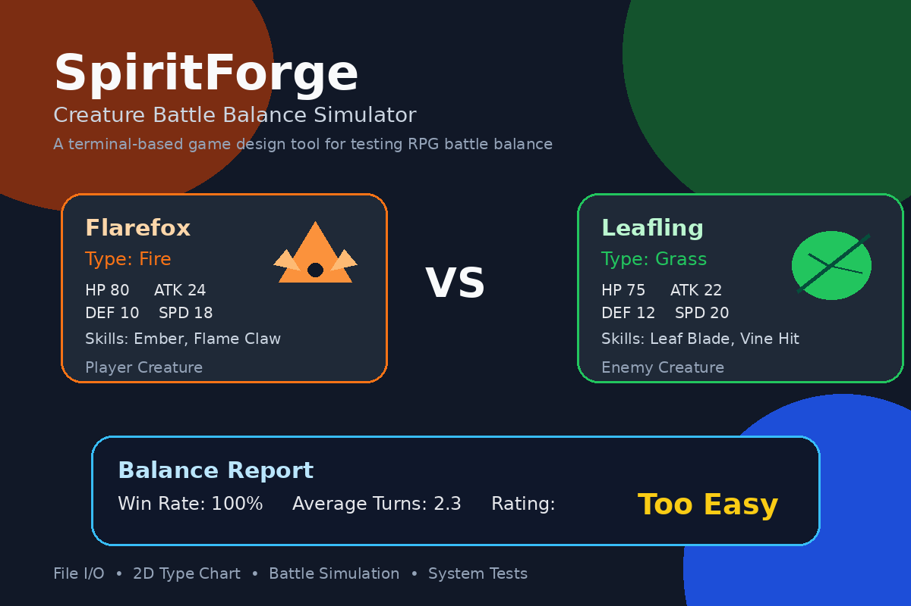

# SpiritForge: Creature Battle Balance Simulator



SpiritForge is a terminal-based Python tool for testing battle balance in creature-collection RPGs. It is designed for student game designers and indie developers who want to check whether a battle encounter is too easy, too hard, or balanced before real playtesting.

The program loads original creature and skill data from text files, simulates turn-based battles, runs automated balance tests, and generates a report with win rate, average battle length, remaining HP, balance rating, and design suggestions.

## Why this project exists

In creature-collection RPGs, battle balance is difficult to judge by intuition alone. A boss may be too strong, a starter creature may defeat enemies too easily, or a type matchup may be too one-sided. SpiritForge helps designers test these situations quickly through simulation.

## Main features

- Load creature data from `creatures.txt`
- Load skill data from `skills.txt`
- View creatures and skills in readable terminal tables
- Choose creatures by number or by name
- Preview matchup details before battle
- Display HP bars during battle logs
- Simulate one battle
- Run multiple automated simulations
- Generate a balance report
- Save report output to text files
- View a 2D type effectiveness chart
- Run built-in system tests

## Advanced Python concepts used

### 1. File I/O

The program reads creature and skill data from external text files and saves generated reports. This means designers can change game values without editing the Python source code.

Files used:

- `creatures.txt`
- `skills.txt`
- `balance_report.txt` generated after saving
- `battle_history.txt` generated after saving

### 2. Multi-dimensional list

The type effectiveness chart in `config.py` is implemented as a two-dimensional list. Rows represent attacking elements, and columns represent defending elements.

### 3. Testing

The project includes a built-in testing mode that checks type multipliers, damage calculation, validation, and simple battle logic.

### 4. Exception handling and control flow

The program uses `try-except`, `raise`, `return`, `break`, and `continue` to handle invalid input, missing files, invalid data, menu control, and battle endings.

## How to run

1. Download or clone this repository.
2. Open a terminal in the project folder.
3. Run:

```bash
python main.py
```

If your computer uses Python 3 as `python3`, run:

```bash
python3 main.py
```

No external Python libraries are required.

## Recommended demo flow

After running `python main.py`, try:

```text
12
```

This runs the guided demo: `Flarefox` vs `Leafling`.

Or use the full manual flow:

```text
1   Load creature database
2   Load skill database
3   View all creatures
5   Simulate one battle
6   Run balance test
8   Run system tests
9   Save latest report
10  Exit
```

Recommended battle test:

```text
Player: Flarefox
Enemy: Leafling
Simulations: 30
```

## Project file structure

```text
main.py              Main menu and user interaction
models.py            Skill, Creature, BattleResult, BalanceReport classes
simulator.py         Battle simulation and damage logic
data_manager.py      File loading and saving functions
tests.py             Built-in system tests
config.py            Type chart and default file names
ui_helpers.py        Terminal UI helper functions
creatures.txt        Creature database
skills.txt           Skill database
README.md            Project explanation
.gitignore           Files to ignore in GitHub
assets/              Representative image for README / Padlet
```

## Example pitch

SpiritForge is not just a creature battle game. It is a game design tool that helps designers make better balance decisions before playtesting.
